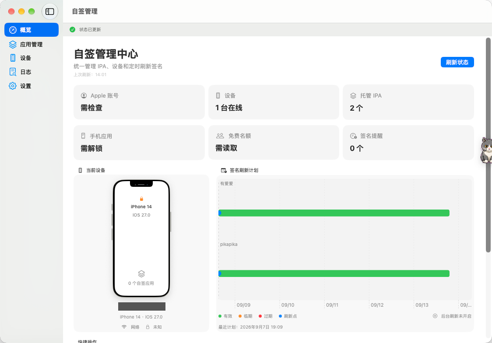
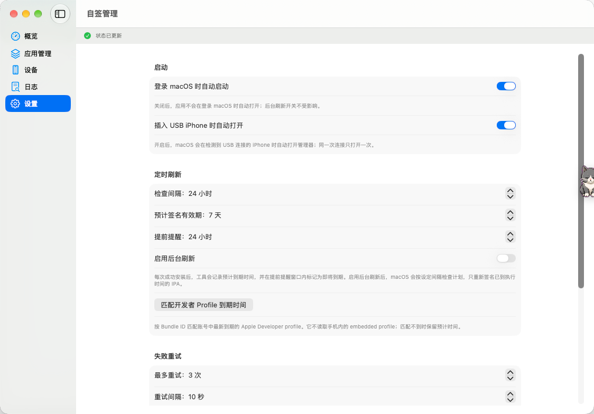

<p align="center">
  
</p>

# SideloadManager: iPhone IPA Signing and Automatic Refresh for macOS

[](https://github.com/Zhang161215/SideloadManager/actions/workflows/build.yml)
[](https://www.apple.com/macos/)
[](https://www.swift.org/)
[](LICENSE)

[简体中文](README.md)

**SideloadManager is an open-source native macOS app for managing developer-signed iPhone apps.** It provides a graphical interface for importing IPA files, discovering connected iPhones, signing and installing apps through [`xtool`](https://github.com/xtool-org/xtool), tracking Apple development provisioning profile expiration, and scheduling re-signing before expiration.

The repository also contains an auditable Apple GrandSlam compatibility patch for `xtool 1.19.0`. It isolates GrandSlam sessions to reduce the effect of unusable connection reuse and performs limited retries at safe authentication transaction boundaries when `gsa.apple.com/grandslam/GsService2/lookup` returns HTML or HTTP 5xx. These responses can otherwise appear as misleading parsing errors such as `The data is not in the correct format`, `Unexpected character '<'`, or `Encountered unknown tag html`.

> SideloadManager is an unofficial project and is not affiliated with Apple or the maintainers of xtool, AltStore, AltServer, or SideStore. Those names belong to their respective owners. It does not bypass Apple account authentication, device restrictions, certificate rules, or Apple Developer Program limits.

## Screenshots

Actual macOS app screenshots (Chinese interface), with the personal device name redacted. The settings shown are an example configuration, not the defaults.

### Dashboard and signing refresh schedule



### Startup, scheduled refresh, and retry settings



## What problem does SideloadManager solve?

- Use a macOS GUI to import, sign, install, and refresh iPhone IPA files instead of repeatedly entering xtool commands.
- Track the usually seven-day signing window of a free Apple development profile and re-sign apps before it expires.
- Handle transient HTML or HTTP 5xx responses from Apple GrandSlam that xtool would otherwise report as plist or JSON parsing failures.
- List only developer-installed apps instead of mixing them with system and App Store apps.
- Check signing schedules in the background, retry failed operations, and refresh due apps when the iPhone is connected and installation requirements are satisfied.

This project is not a permanent signing service or a tool for bypassing Apple restrictions. Automatic refresh still requires a running Mac, an iPhone that Xcode can discover, trust between the device and the Mac, and valid account, network, and signing-quota state.

## Features

- Detects iPhones connected over USB or the network and deduplicates them by UDID; current management operations target the first available device
- Shows the device name, model, OS version, connection type, and lock state
- Imports and locally archives IPA files, including the app name, bundle identifier, and icon
- Lists developer apps, which normally include sideloaded and development-signed apps, without mixing in system or ordinary App Store apps
- Signs, installs, refreshes, and uninstalls apps with clear running, success, and failure feedback
- Matches original and XTL bundle identifiers to the latest-expiring account-side profile whose state is `ACTIVE` and type is `IOS_APP_DEVELOPMENT`
- Provides expiration alerts, search, status filters, and a visual refresh schedule
- Uses launchd to wake hourly, evaluate the configured schedule, retry failures, and send macOS notifications
- Background refresh, launch at login, and USB auto-open are optional and all disabled by default
- Removes common proxy environment variables from xtool and `devicectl` child processes without changing macOS system proxy, VPN, or certificate settings

## Current scope and limitations

- SideloadManager can detect and deduplicate multiple iPhones, but it currently has no device selector. Install, uninstall, installed-app discovery, and background refresh target the first available device.
- Expiration dates come from account-side development provisioning profiles, not directly from an installed app's embedded profile. An estimated date is retained when no profile matches.
- The background agent checks the schedule hourly. It is not an exact-time scheduler and does not wake a sleeping Mac.
- Refresh requires the original IPA, a valid xtool login, an awake Mac, and a reachable iPhone. It cannot complete while the device is unavailable.
- It does not bypass two-factor authentication, certificate revocation, the free-profile expiration period, installed-app limits, or App ID limits.

## Relationship to xtool, AltStore, AltServer, and SideStore

| Component | Role in this project |
| --- | --- |
| **SideloadManager** | The SwiftUI manager in this repository. It handles IPA archives, device state, expiration schedules, logs, and background jobs. |
| **xtool** | The backend that performs Apple ID authentication, development signing, and IPA installation. SideloadManager does not reimplement its signing protocol. |
| **xtool-fixed** | Built by this repository from a pinned xtool 1.19.0 upstream commit with the auditable GrandSlam retry patch applied. |
| **Xcode `devicectl`** | Reads iPhone model and connection details, developer-installed apps, and app icons, and performs device operations such as uninstalling apps. |
| **AltStore / AltServer / SideStore** | Independent projects that are not dependencies of SideloadManager. This repository neither modifies their login implementations nor implements their refresh protocols. |

If AltServer or SideStore reports a similar Apple login format error, SideloadManager provides an independent workflow based on xtool. The GrandSlam patch applies only to the `xtool-fixed` build produced by this repository. Re-signing an app installed by another tool still requires its original IPA.

## How it works

```text
SideloadManager
  |-- manages IPA files, schedules, logs, and local state
  |-- calls xtool for Apple login, signing, and installation
  `-- calls Xcode devicectl for device and developer-app information
```

The locally running `xtool` communicates with Apple services for authentication. SideloadManager does not receive the plaintext password, and the macOS xtool build stores a successful login token in the `sh.xtool.keychain.credentials` Keychain service. This repository does not contain Apple IDs, passwords, verification codes, login tokens, Team IDs, device UDIDs, IPA files, pre-signed profiles, or personal configuration.

## Requirements

- macOS 14 or later
- Xcode 26.3 and the Xcode Command Line Tools, or a newer toolchain that supports Swift 6.2
- The manager package uses Swift tools 6.0; the complete build including patched xtool requires Swift 6.2
- `git`, network access to GitHub, and a working `xcrun devicectl`
- A trusted and unlocked iPhone whose iOS version is supported by the installed Xcode version
- Developer Mode enabled on the iPhone when required by iOS
- Your own Apple ID; free developer accounts are supported within Apple's limits
- [XcodeGen](https://github.com/yonaskolb/XcodeGen) when building the patched `xtool.app`

## Build and install from source

The repository currently provides source code and build scripts rather than a precompiled GitHub Release. The build checks out a pinned official xtool revision, verifies and applies the patch locally, compiles it, and applies an ad-hoc signature.

```bash
git clone https://github.com/Zhang161215/SideloadManager.git
cd SideloadManager

# 1. Build xtool.app from the pinned upstream revision and apply the patch
./scripts/build-xtool.sh

# 2. Build SideloadManager.app
./scripts/build-app.sh

# 3. Install both apps in the current user's Applications directory
./scripts/install.sh
```

After installation, sign in to your Apple ID once from Terminal. The Apple ID username in the command may remain in shell history; the password and two-factor verification code are read interactively and are not placed there:

```bash
~/Applications/xtool-fixed.app/Contents/Resources/bin/xtool \
  auth login --mode password --username 'your Apple ID'
```

Open `~/Applications/SideloadManager.app`, then import an IPA from the App Management view. You can also set `SIDELOAD_XTOOL_PATH` to an existing xtool executable or `.app` bundle. SideloadManager additionally searches common installation locations and `PATH`.

## Apple GrandSlam compatibility patch

The patch targets xtool `1.19.0` at this pinned upstream commit:

```text
893cf4f8f916673922a47bb94601ead6efc7669f
```

Its scope is limited to the GrandSlam networking compatibility layer:

1. On macOS, each GrandSlam request uses a one-shot ephemeral `URLSession` that is released after the complete response is read. Other xtool requests and WebSocket connections are unaffected.
2. It detects `text/html`, XHTML, HTML preceded by a BOM or XML declaration, and temporary HTTP 5xx responses without misclassifying valid XML property lists.
3. Endpoint lookup retries an individual GET request. Primary authentication retries the complete SRP transaction, and App Token retrieval retries the complete token request. SMS delivery and verification-code submissions are never replayed automatically.
4. A request is attempted at most five times, with delays of 1, 2, 4, and 8 seconds after failures. Exhausted retries produce an explicit GrandSlam transient-response error.
5. Response-detection tests are included, and CI applies and compiles the patch against the pinned upstream commit.

The source patch is available at [`patches/xtool-1.19.0-grandslam-retry.patch`](patches/xtool-1.19.0-grandslam-retry.patch). The build script verifies the pinned revision before applying it. The repository does not commit a modified opaque binary or any embedded provisioning profile.

## Free Apple developer account limits

A free Apple development provisioning profile usually expires after seven days. Apple also limits the number of sideloaded apps and App IDs available to a free account on one device; three installed apps is a common limit, but Apple controls the rule and may change it. If installation reports the following error, remove or deactivate an existing sideloaded app before trying again:

```text
This device has reached the maximum number of installed apps using a free developer profile
```

These limits are enforced by Apple services and iOS, and SideloadManager cannot remove them. Disabling **Offload Unused Apps** on iOS and cleaning up offloaded apps that still consume a slot can help prevent incorrect counting.

## Apple login and signing troubleshooting

### `The data is not in the correct format`, `Unexpected character '<'`, or `unknown tag html`

When they occur during xtool GrandSlam login, the following messages usually describe the same condition: the client expected a plist or JSON response from Apple, but the received body started with `<html>`.

```text
The data couldn't be read because it isn't in the correct format.
Encountered unknown tag html on line 1
Unexpected character '<' around line 1, column 1
Malformed data byte group at line 1; invalid hex
```

Possible causes include a temporary Apple gateway failure, an interception page returned by a proxy or VPN, TLS interception, or a regional network route. Check the macOS system proxy, VPN, traffic-inspection certificates, and network route before using the `xtool-fixed` build from this repository.

The patch isolates GrandSlam network sessions and retries transient HTML or 5xx responses only at safe authentication transaction boundaries. It does not retry ordinary transport failures, cannot fix a persistent block, an abnormal account state, or continuing TLS interception, and does not change AltServer's implementation.

### `A TLS error caused the secure connection to fail` or `Failed to perform authentication handshake`

Check the system time, proxy or VPN configuration, user-installed root certificates, and network route. SideloadManager removes proxy variables from child-process environments, but it does not modify macOS system proxy settings.

### `MID is invalid (-80009)`

Sign out, reset xtool's two-factor authentication device data, and then sign in again. Frequently changing networks or repeatedly attempting login can trigger Apple risk controls, so avoid rapid repeated attempts.

### Do I need AltServer, AltStore, or SideStore?

No. SideloadManager calls xtool directly for login, signing, and installation and uses Xcode `devicectl` for device management. It can coexist with other sideloading tools, but they all remain subject to Apple's account and device limits.

### Can SideloadManager refresh apps automatically without reconnecting the iPhone?

Not unconditionally. launchd wakes hourly and then evaluates the configured interval and next-run time; it does not wake a sleeping Mac. A refresh also requires a valid xtool login, the original IPA in the local archive, and an iPhone discoverable over USB or a working network pairing. The device must satisfy the applicable unlock, trust, Developer Mode, account, and quota requirements.

### Why does SideloadManager show only some installed apps?

This is intentional. SideloadManager uses `devicectl --no-include-default-apps` to discover developer apps, which normally include sideloaded and development-signed apps. System apps and ordinary App Store apps do not appear in the installed-app view, and phone discovery alone does not add any app to the managed IPA archive.

### How do I refresh an expired app already installed on the iPhone?

Re-signing requires the original IPA. Import the matching IPA into SideloadManager, then select Refresh. Reading the app name from the iPhone cannot reconstruct the original installation package.

### Is the displayed profile expiration the exact expiration of the app installed on the iPhone?

Not necessarily. SideloadManager selects the active development provisioning profile with the latest expiration date for the matching bundle identifier and uses it to plan refreshes. `devicectl` does not expose the complete embedded profile of an installed app. If several profiles share a bundle identifier, the interface shows the best account-side match and labels it as **Profile expiration**.

## Local data

SideloadManager stores configuration, archived IPA files, icons, and background logs under:

```text
~/Library/Application Support/SideloadManager/
```

The macOS xtool build stores a successful login token in the `sh.xtool.keychain.credentials` Keychain service. That authentication data is outside this repository. Before submitting an issue, remove Apple IDs, Team IDs, UDIDs, tokens, and local filesystem paths from logs.

## Development

```bash
swift build
swift run SideloadManager
```

Running `swift run` is suitable for development and debugging. Use `scripts/build-app.sh` to produce an `.app` bundle with login launch support, USB auto-open support, and the complete application icon.

Project layout:

```text
Sources/SideloadManager/   SwiftUI application source
Resources/                 Info.plist and application icons
patches/                   Auditable xtool source patch
scripts/                   Build and installation scripts
```

## Security and disclaimer

Password login depends on non-public Apple interfaces that may change without notice. Use SideloadManager only with accounts, devices, and applications that you own or are authorized to test. Review the patch and build it from source when possible. You are responsible for account restrictions, certificate revocation, data loss, and other risks resulting from use of this software.

## License

SideloadManager is available under the [MIT License](LICENSE). `xtool` is developed by Kabir Oberai and contributors under the MIT License; see [NOTICE](NOTICE) for attribution details.
